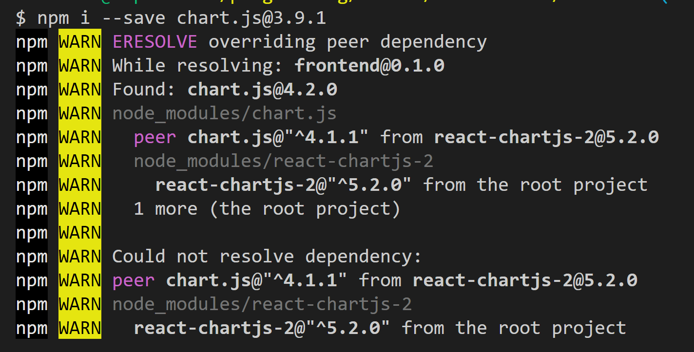

# Chart.js Notes

### [npm docs](https://www.npmjs.com/package/chart.js?activeTab=readme)

It appears Chart.js comes with TS support out of the box.

### [Official Docs](https://www.chartjs.org/docs/latest/getting-started/integration.html)

Two big issues in this process were:
1. Transferring data from client app as prop over to Chart JS component
2. Compiling it!

## Transferring data...

At one point I thought that each chart.js component was strongly typed and accepted specific props. I thought I needed to perform a merging declaration to 'update' the chart.js component to accept different props. I'm leaving the extendChart.d.ts file for now in case it did cause environment benefits, but it appears that it wasn't necessary and will be deleted later when I'm certain.

So it turns out that components only have one property which is props...
[Stack Overflow: Property 'param1' does not exist on type](https://stackoverflow.com/a/55075911/15592981)

In the end I was able to add the props like so `MyBar(props: {eventLabels: string[], eventData: number[]})`
and use the props like this => `labels: props.eventLabels`

## Compiling it...

The error shown was:
`./node_modules/babel-loader/lib/index.js You may need an additional loader to handle the result of these loaders. | | class DatasetController`

Thankfully there was a quick and dirty solution

[Stack Overflow - chart.js 695:18](https://stackoverflow.com/a/74559895/15592981)

The following was an error that may be important later on in the development process.  

